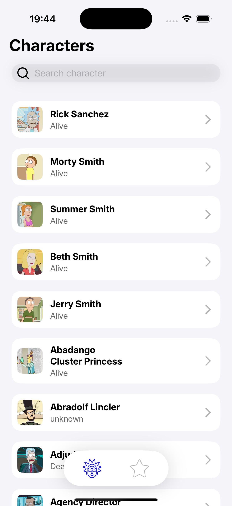
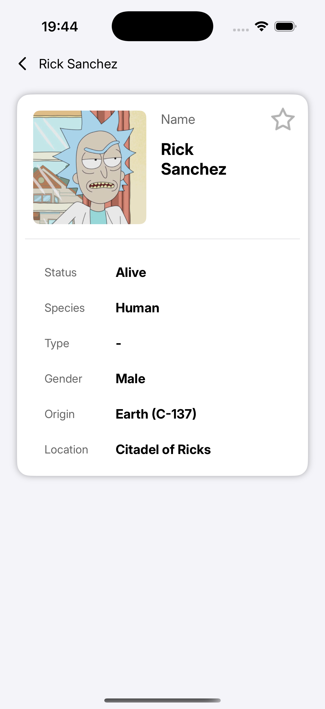
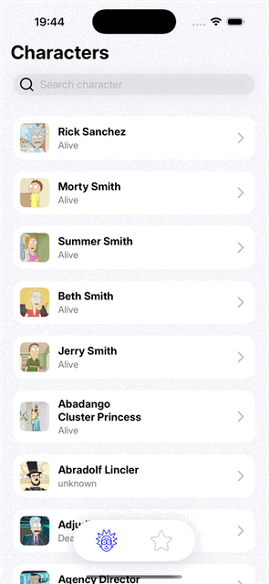
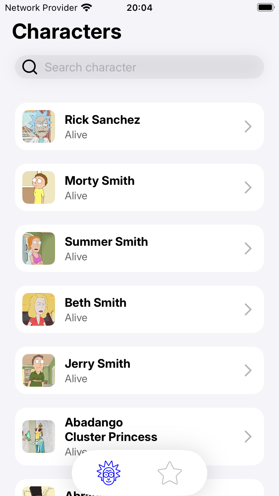
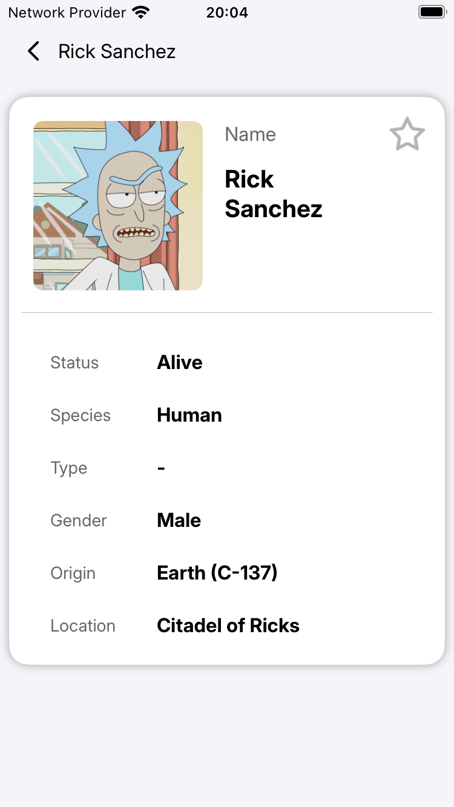
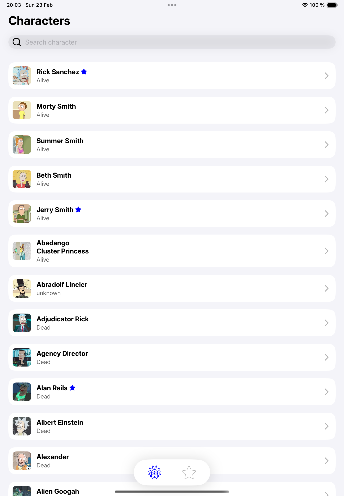
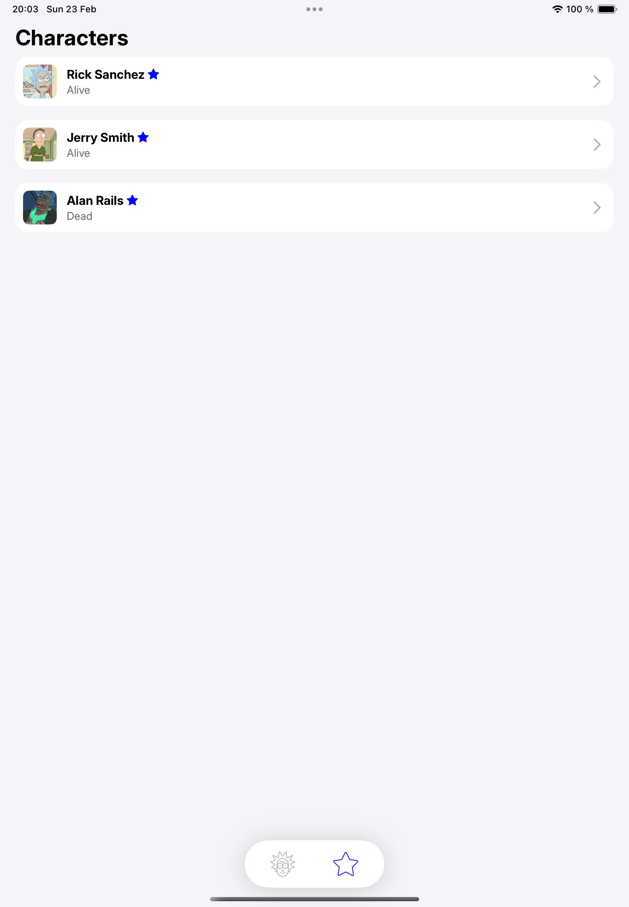
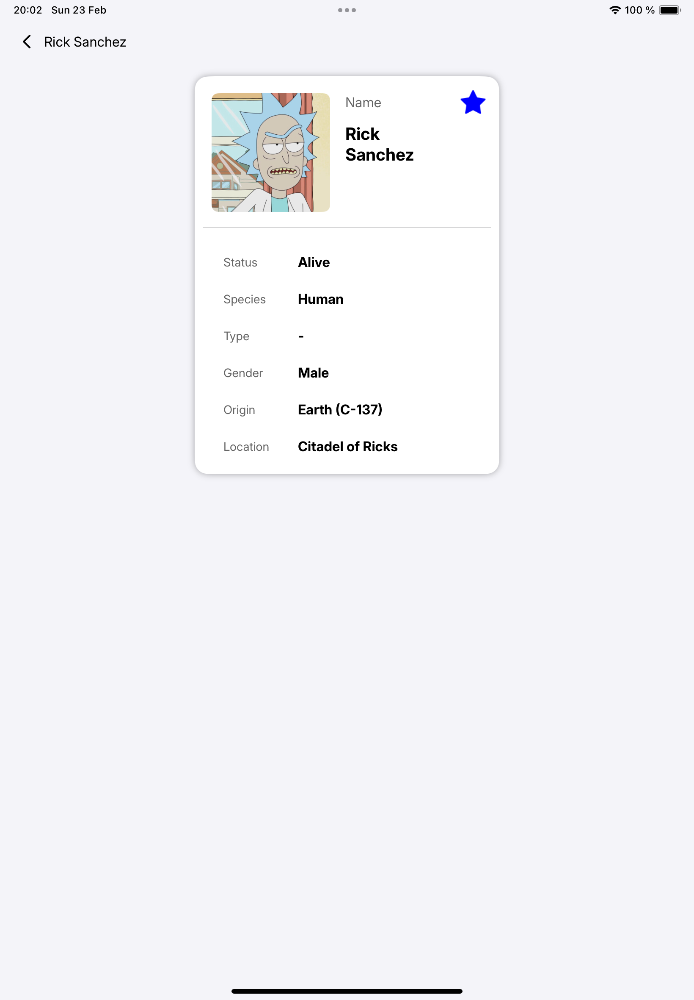

# Rick and Morty App 

This is iOS appliction (tesk task) is created as a part of interview for ackee.cz by Roman Holovai at 23.02.2025  
<a href="https://github.com/AckeeCZ/ios-task-rick-and-morty?tab=readme-ov-file">HERE</a> you can see basic requirements and design of this project.

# Criteria of app:
- [x] Project created on SwiftUI / MVVM.
- [x] UI created from scratch with design in figma.
- [x] App support dark mode.
- [x] List of character with paging.
- [x] Search page with paging.
- [x] In project have used async/await.
- [x] Running on iPhone/iPad(portrait and landscape orientation).
- [x] Added <a href="https://github.com/onevcat/Kingfisher">Kingfisher</a> for image caching for best user experience.
- [x] Network layer created in package and added with SwiftPM.
- [x] Created some test for DataManager package(I heard that you love it 😁)
- [x] Git

# Screenshots & screen video iPhone 16 pro:

  
  
  

# Screenshots iPhone SE:

  
  

# Screenshots  iPad 10:

  
  
  

